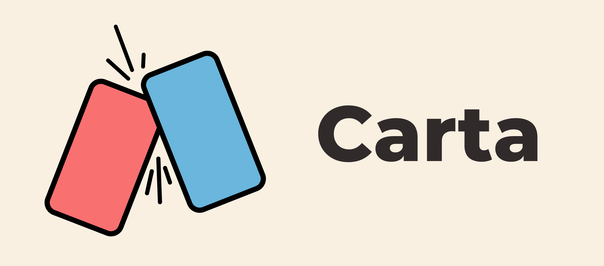

# Carta

Carta is a card game with a battle engine powered by LLM, you can play it on Discord.

The cool part is that you can make your own cards with natural language, and the LLM will understand them and use them in the game with logical reasoning of the battle process, including skill casting and rarity counters. Unleash your creativity and imagination!

This project was originally made for a commissioned work, but it got halted due to financial reasons. Because I find the core idea novel and interesting, I decided to open source it for the community to enjoy and contribute.

Carta is currently undergoing a transition to support the following features:

- Multiple LLM providers (Currently only OpenAI is supported)
- i18n support (Currently only Traditional Chinese is supported)
- Multiple guild support
